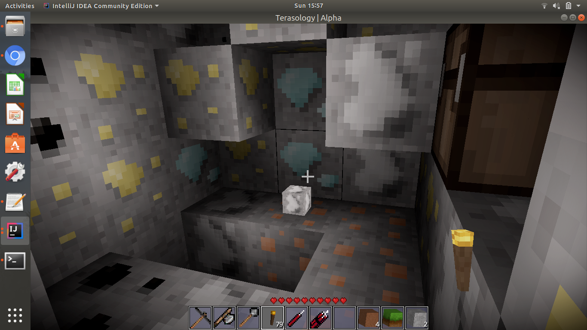
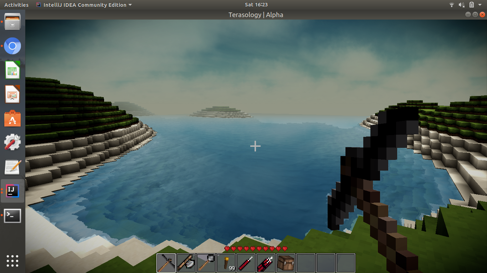

# Terrasology-World_Generator-III

A world generator made using Terasology for GCI 2018

This world generator uses two plugins :

- A plugin to make blocks below the earth mineral ores.

-

- A plugin to add water below sea level.(I had used this plugin in the second task, still as it was a plugin I included it!)

-

Hope you like it.
